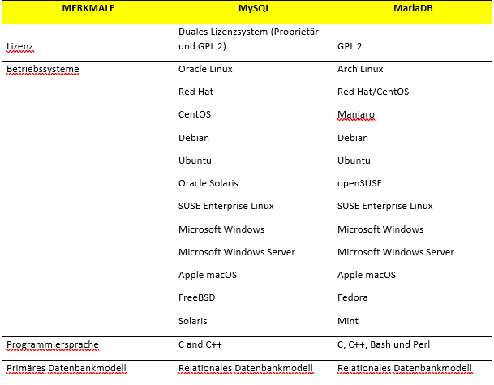
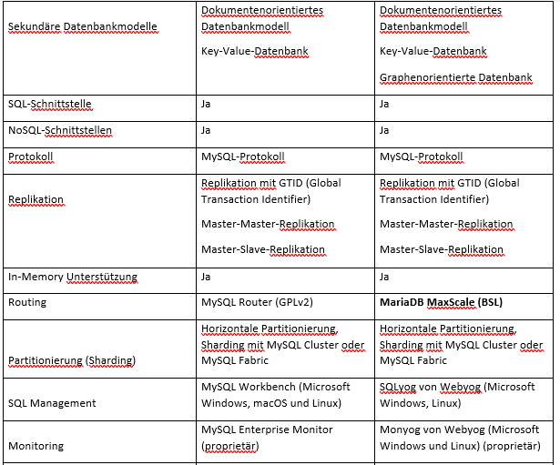
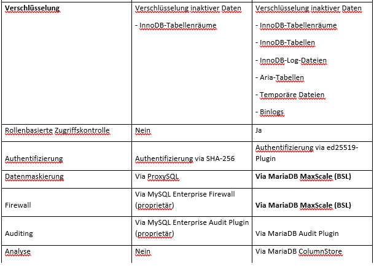
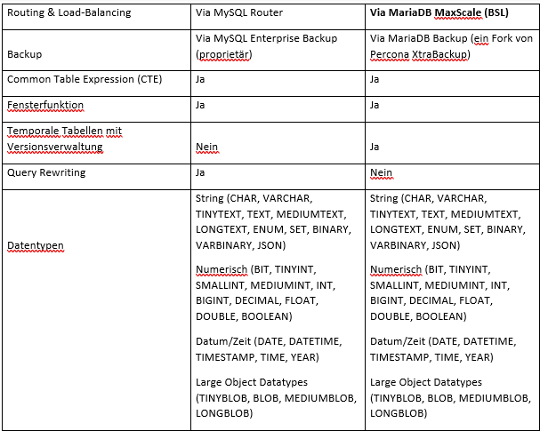
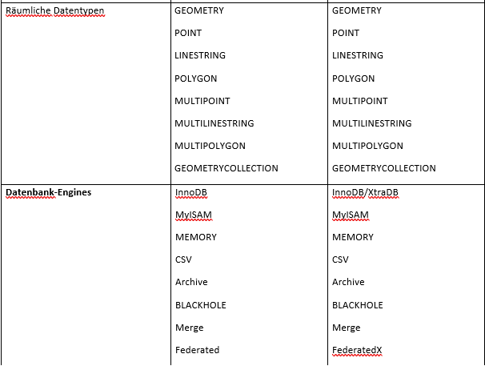
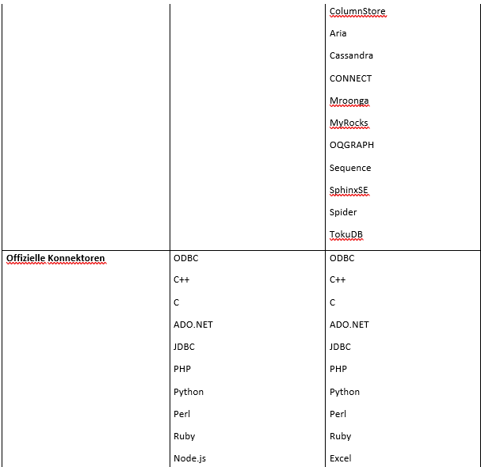

# Datenbanken
Ein Datenbanksystem ist ein System zur elektronischen Datenverwaltung. Es
unterstützt die computergestützte Datenverarbeitung von Informationen die durch
eine Datenbankapplikation erzeugt und verarbeitet werden. Außerdem strukturiert es
und speichert diese Informationen in eine Datenbank ab.
Eine Datenbank dient der strukturierten Speicherung und Verwaltung von
Informationen, die einen Teilausschnitt aus der realen Welt abbilden und persistieren.
Durch eine Datenbank (DB) wird eine einheitliche und anwendungsneutrale Sicht auf
die Daten ermöglicht.

## Aufbau eines Datenbanksystems
Der Aufbau eines Datenbanksystems besteht aus einer **Datenbank (DB)**, welche die
**Datenbasis** darstellt, und aus einem **Datenbankmanagementsystem (DBMS)**.
Die **Verwaltungssoftware** organisiert intern die strukturierte Speicherung der Daten
und kontrolliert alle lesenden und schreibenden Zugriffe auf die Datenbank.
Ein **Datenbankmanagementsystem** abstrahiert die Details von Hard- und
Software-Komponenten eines Systems. Dadurch können Datenbanken
anwendungsunabhängig definiert, konstruiert und manipuliert (verändert) werden. Ein
Datenbankmanagementsystem (DBMS) bietet schnelle und effiziente Zugriffsverfahren,
um Daten verarbeiten zu können.
## Die zentralen Aufgaben eines Datenbanksystems
Die zentralen Aufgaben eines Datenbanksystems sind die Entgegennahme großer strukturierter
Datenmengen, deren Speicherung und Verwaltung sowie die Abfrage von Daten.
Um die komplexen und vielseitigen Anforderungen an eine konsistente und einheitliche Datenhaltung
zu erfüllen, müssen Datenbanksysteme eine Reihe von Merkmalen aufweisen. Die Anforderungen an
ein Datenbanksystem sind:
* **Datenunabhängigkeit:** Anwendungsprogramm und Datenhaltung sollten unabhängig
voneinander sein.
* **Effizienter Speicherzugriff:** Verwendung von Speichertechniken, um die
Datenverarbeitung effizient zu gestalten (z. B. Indizes).
* **Paralleler Datenzugriff:** Mehrere Benutzer müssen gleichzeitig auf die Daten zugreifen
können. Hierfür benötigt es Protokolle für Transaktionskontrollen.
* **Datenkonsistenz:** Eine Veränderung der Daten muss vollständig sein und zuvor definierte
Regeln einhalten.
* **Gemeinsame Datenbasis:** Die Daten werden zentral abgelegt und verwaltet.
* **Datenintegrität:** Daten müssen vollständig und den Regeln entsprechend korrekt sein,
ansonsten ist die Speicherung zu verhindern (z. B. Verweis auf einen nicht vorhandenen
Fremdschlüssel).
* **Datensicherheit:** Der Zugriff darf nur durch autorisierte Benutzer gestattet werden.
* **Wiederherstellungsverfahren:** Im Fehlerfall muss ein Backup- oder Recovery-Verfahren
zur Wiederherstellung einer konsistenten Datenbank vorhanden sein.
* **Abfragesprache:** Ein Datenbanksystem (DBS) muss eine Möglichkeit für die
Datenmanipulation (Abfrage, Aktualisierung, Berichtsgenerierung, Veränderung)
bereitstellen (bei relationalen DBS ist dies meist eine Form von SQL).
* **Keine / kontrollierte Redundanz:** Um Inkonsistenz und Integritätsverletzungen zu
vermeiden, sollte die redundante (mehrfache) Speicherung von identischen Daten
verhindert werden. In Ausnahmefällen kann Redundanz zur Performance-Optimierung
verwendet werden, dies sollte jedoch überwacht warden.

# MySQL versus MariaDB
Entwickler beider Datenbankmanagementsysteme ist *Michael "Monty" Widenius*. **MySQL** wurde 1994 entwickelt, **MariaDB** gibt es seit 2009. Beide begannen als Open Source Projekte. Die Kommerzialisierung von **MySQL** fand schrittweise statt. 2008 wurde **MySQL** an Sun Microsystems verkauft, jene Entwicklerfirma, wo auch Widenius und sein Team arbeiteten. 2010 kaufte Sun Microsystems dann Oracle und begann beide Systeme gewinnbringend zu vermarkten. Im Open Source Bereich geschah nur mehr wenig. Widenius und sein Team gründeten eine eigene Firma und begannen an dem frei zugänglichen **MySQL-Fork MariaDB** zu arbeiten. Maria ist der Name der zweiten Tochter des Entwicklers Widenius. Die neue Firma wurde (im Gegensatz zum Geschäftsmodell von Oracle) strikt unterteilt in einen kommerziellen Zweig, der *MariaDB-Corporation*, und einen Open Source (Community) Bereich – der MariaDB-Foundation
Die Ziele der MariaDB Foundation:
*	die **MySQL**-Talente unter einem Dach zusammenhalten
*	den Fortbestand der Community-Entwicklung fördern
*	sicherstellen, dass immer eine freie Version von **MySQL** existiert
**MariaDB** hat einen starken Fokus auf die offene Entwicklung. Im Vordergrund stehen zwei Grundsätze:
*	Der Quellcode von sich in der Entwicklung befindenden Programmteilen steht über öffentliche Respositorys zur Verfügung.
*	Alle Entwicklungsschritte werden öffentlich dokumentiert.
Die Datenbank-Managementsysteme **MySQL** und **MariaDB** basieren auf demselben Software-Kern. Bis **MySQL Version 7** waren beide Systeme kompatibel, d.h. Drop-In Replacement und sogar Upgrades sollten in beide Richtungen funktionieren. **MySQL 8** ist nicht mehr abwärtskompatibel, weder zu seinem eigenen System, noch zu **MariaDB**.

